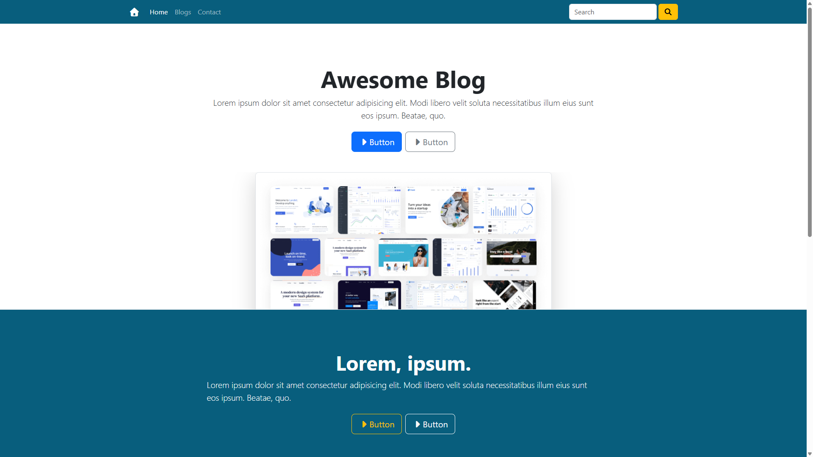
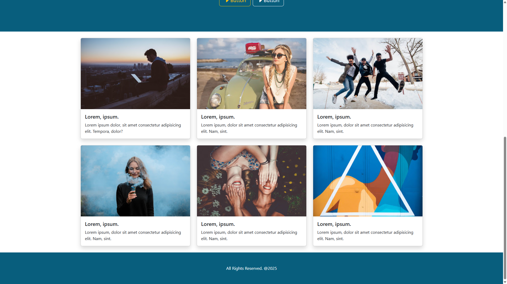
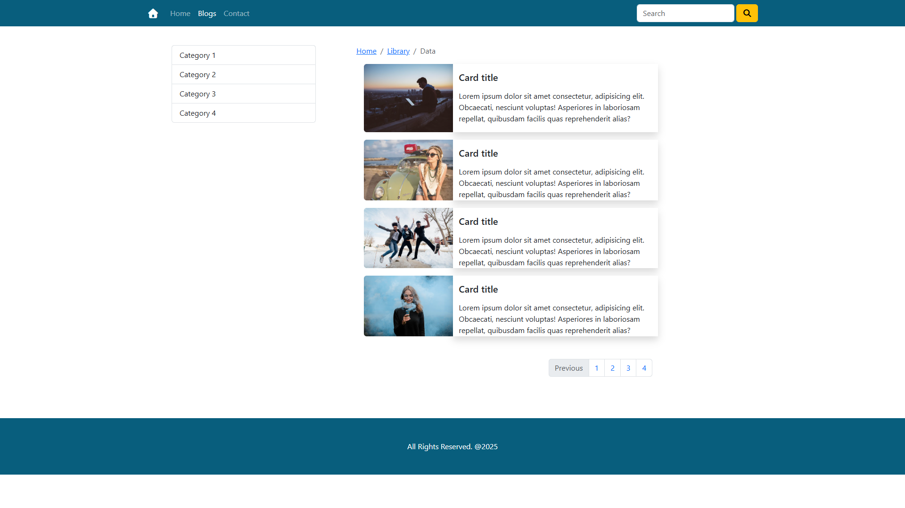
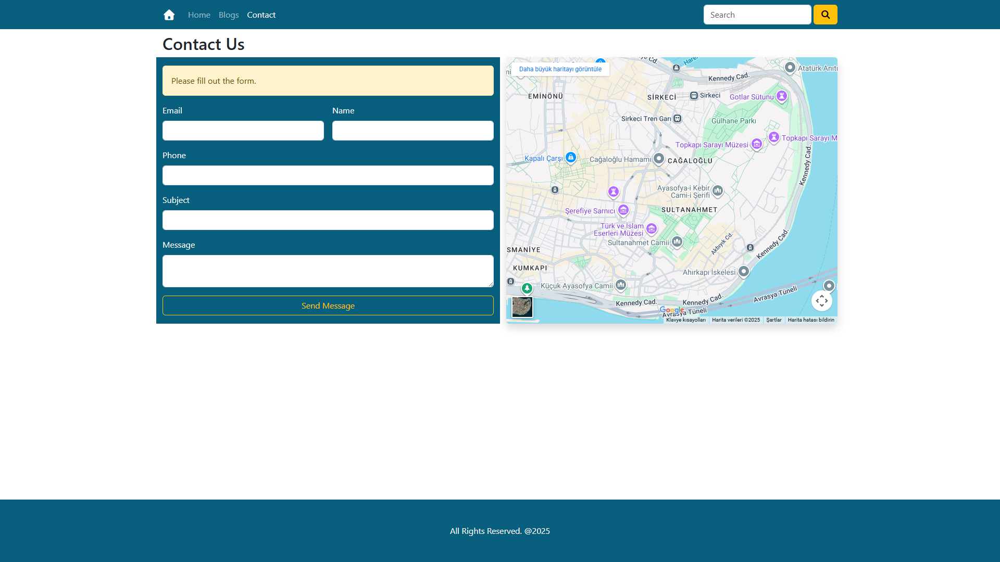

# 📝 Awesome Blog

A modern and fully responsive blog website built with **HTML5, CSS3, and Bootstrap 5**.  
The project includes a hero section, blog listing page, categories sidebar, pagination, and a contact page with Google Maps integration.

---

## 🚀 Technologies Used

---

## 📸 Screenshots

### 🏠 Home – Hero Section

### 📰 Home – Blog Cards

### 📚 Blogs Page

### ✉️ Contact Page

---

## ✨ Features

- Fully responsive layout (mobile, tablet, desktop)
- Modern Bootstrap 5-based UI
- Hero section with title, description and image
- Blog listing page with multiple posts
- Categories sidebar
- Pagination component for blog navigation
- Contact form with Google Maps embed
- Font Awesome icons used across the UI
- Clean and easy-to-maintain project structure
